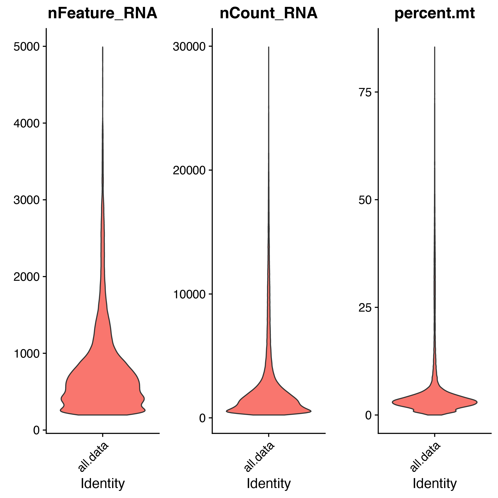
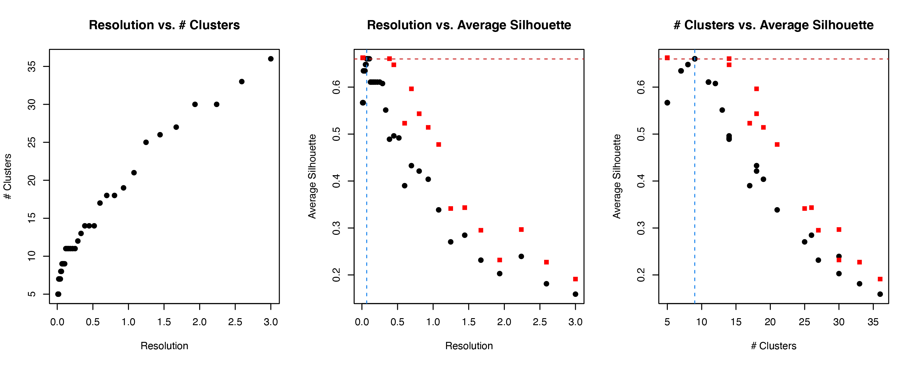
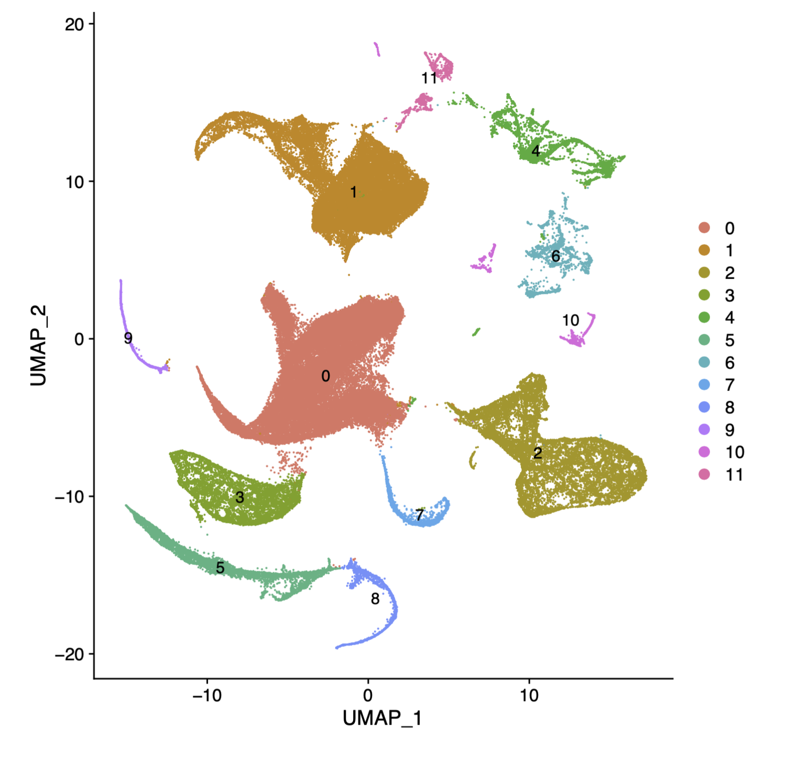

#### [Ben Doran](https://github.com/BenjaminDoran) and [Kyle Kimler](https://github.com/kylekimler)

#### Compiled: August 13, 2021

ARBOL iteratively explores axes of variation in scRNAseq data by clustering and subclustering until variation between cells in subclusters becomes noise. The philosophy of ARBOL is that every axis of variation could be biologically meaningful, so each should be explored. Once every possibility is explored, curation and a statistical interrogation of the resolution are used to collapse clusters into the elemental transcriptomes of the dataset. ARBOL inherently builds a tree of subclustering events. As data is separated by the major axes of variation in each subset, further rounds capture less pronounced variables. This comes with some caveats: variation shared by all celltypes make up one of the major axes of variation in the first round of clustering. Celltypes can split up at the beginning, so the same splitting of e.g. B and T cells might happen further down in separate branches. Thus the resulting clustering tree is neither indicitave of true distances between end clusters nor a tree of unique groupings. We address this by manual curation of cell types, subtypes, and states, using literature-defined markers in the end clusters, an [end-cluster naming method](https://kylekimler.shinyapps.io/shinyrank/) that captures the unique markers of the end clusters, and the calculation of a binary tree of these manually curated end clusters, providing a distance between the elemental transcriptomes of the dataset.  

ARBOL was built to be a modular software. Currently it iterates through the default Seurat analysis pipeline, with two additions that enable automation: <br>
- PCs used in clustering are chosen by 15 percent improvement of variance explained<br>
- clustering parameters are chosen by maximization of silhouette size on a downsampled parameter scan<br>  
Normalization, dimensionality reduction, clustering, and plotting methods are set apart in the code in modularized functions to enable customization. 

We saw a need for this software to address the fact that we were constantly manually subclustering scRNAseq data, and because other iterative clustering softwares like scPanoView and iterclust are tailor built for specific clustering methods outside of the Seurat paradigm.

This tutorial uses the following model datasets:
<br>
- pediatric FGID from the paper: 89849 cells x 22431 genes
<br>
- Nasal Polyp ([Ordovas-Montanes et al 2018](https://www.nature.com/articles/s41586-018-0449-8)): 19196 cells x 22360 genes  

# FGID ARBOL
Reproducing figures for the 2021 paper  

## Running ARBOL
The [github page](https://github.com/ShalekLab/SCTieredClustering) describes ARBOL  
ARBOL is called directly on a seurat object:  

```{r,message=FALSE,warning=FALSE,echo=FALSE}
source('/Users/kkimler/Projects/SCTieredClusteringIntermediates/SCTieredClustering_Annotation_Dendrogram_Module.R')
library(Matrix)
```

```{r,message=FALSE,warning=FALSE,eval=FALSE}

srobj <- readRDS("/path/to/full_seurat_object.rds")
endclustSrobjs <- GenTieredclusters(srobj,
                           saveSROBJdir = "~/tieredoutput/srobjs",
                           figdir = "~/tieredoutput/figdir",
                           SaveEndNamesDir = "~/tieredoutput/endclusts")
```

Specifying output directories saves QC statistics  
<br>
  
<br>

clustering decision metrics

  
<br>

differential expression results among clusters (and visualizations) at each level in 'figdir'  
```{r,echo=FALSE,message=FALSE,warning=FALSE}
de <- fread('/Users/kkimler/Projects/SCTieredClusteringDev/TutorialDocs/Tiered-FGID-13_20191028_FGID_tiered_clusters_output_figs_top10markers.tsv')
de %>% head
```
<br>
and UMAP visualizations at each tier.  
  
<br>
<br>

Finally, GenTieredClusters() also saves subset seurat objects for each cluster in 'srobjs', and saves files with lists of cells per end-cluster in 'endclusts'.  
<br>


Iterative clustering is enabled by automation of two key parameter choices. Principle components are chosen using two heuristics: when more than 500 cells are present, PCs are included if they explain 15% more variance than the following component. When less than 500 cells, Seurat's Jackstraw method is used to calculate significant principle components. Clustering is performed automatically by performing a parameter scan on a downsampled dataset using Seurat's built-in Louvain clustering. Silhouette measures the ratio of intra-cluster distance to inter-cluster distance, where a high score means highly distinct clusters. For stages where we were clustering more than 500 cells, a randomized subsample of N cells / 10 was used in the parameter scane.

<br>
<br>

## Working with ARBOL results
I prefer to load tiered cluster data into a dataframe, which I can use directly for comparisons or which I can reattach to the full seurat object's metadata for annotation, dendrogram production, and other analysis. 

```{r}
LoadTiersAsDF <- function(folder='./tieredoutput/endclusts',maxtiers=10) {
  tierfiles <- list.files(folder,full.names=TRUE,recursive=TRUE)
  sample_strings <- sub('\\..*$','',basename(tierfiles))
  sample_strings <- sub('_T0C0_', '',sample_strings)
  tiers <- map2(tierfiles, sample_strings, ~fread(.x,header=FALSE) %>% mutate(id = .y))
  tiers <- rbindlist(tiers) %>% data.frame
  tiers$id <- gsub('_','.',tiers$id)
  tiers <- tiers %>% separate(id,into=paste0('tier',1:maxtiers),sep='\\.',remove=FALSE)
  tiers <- tiers %>% rename(CellID=V1)
  tiers <- tiers %>% data.frame %>% rename(tierNident=id)
  return(tiers)
}
```

```{r,eval=FALSE}
fgtiers <- LoadTiersAsDF('~/PREDICT_3p_Paper/FGID/tieredoutput/endclusts')
```

```{r,echo=FALSE,message=FALSE,warning=FALSE}

meta <- fread('/Users/kkimler/Projects/PREDICT/data/20200630_clmeta_FG13_all.tsv')
fgtiers <- meta %>% 
			select(CellID,tierNident) %>% 
			separate(tierNident,into=paste0('tier',1:10),sep='\\.',remove=FALSE) %>% 
			data.frame
``` 

```{r,message=FALSE,warning=FALSE}
print(head(fgtiers))
```

## Add ARBOL annotations to the seurat object

```{r,eval=FALSE}
srobj <- readRDS('~/PREDICT_3p_Paper/FGID/srobj.rds')
```

```{r,echo=FALSE}
srobj <- readRDS('/Users/kkimler/Projects/PREDICT/data/All_FG_filtered_ILE_forITCvignette.rds')
```

```{r,message=FALSE,warning=FALSE, echo=FALSE, results='hide'}
suppressMessages(ifelse(any(colnames(srobj@meta.data)=="CellID"), srobj@meta.data <- srobj@meta.data, srobj@meta.data$CellID <- rownames(srobj@meta.data)))
```

```{r}
srobj@meta.data <- srobj@meta.data %>% cbind(as.data.frame(str_split_fixed(srobj@meta.data$CellID,"_",n=6))) %>% dplyr::rename(patient = V1, time_point = V2, tissue = V3, sample_site = V4, seqDirection=V5,barcode=V6)

srobj@meta.data <- srobj@meta.data %>% left_join(fgtiers,by="CellID")

print(head(srobj@meta.data))
```

## End cluster diversity analysis
In the paper, we used a diversity metric, the Gini-Simpson's Index, to measure diversity of patients in our end clusters to determine if the cluster was powered for differential analysis. Gini-Simpson's index is calculated as  

$diversity = 1 - \lambda = \sum_{i=1}^{R} p_{i}^{2}$
  
R is the total number of patients in the dataset while $p_{i}$ is the proportional abundance of each patient in the end clusters. lambda is subtracted from 1 because in datasets with fewer patients, lambda will be inflated.

1 indicates equal representation of all patients within a subset and 0 indicates a completely patient specific subset

```{r}
tierNdiversity <- srobj@meta.data %>% group_by(tierNident) %>% 
		summarize(diversity = 1 - sum(((table(patient)) / (length(patient)))^2)) 
curatedNamediversity <- srobj@meta.data %>% group_by(curatedname) %>% 
		summarize(diversity = 1 - sum(((table(patient)) / (length(patient)))^2))

```

We used patient diversity among end clusters to inform manual curation

```{r,fig.height=5,fig.width=10,message=FALSE,warning=FALSE}
s1 <- ggplot(tierNdiversity,aes(x=diversity))+ geom_histogram() + ggtitle("raw ARBOL results")
s2 <- ggplot(curatedNamediversity,aes(x=diversity))+ geom_histogram() + ggtitle("after manual curation")
s1+s2
```
  
```{r,echo=FALSE,message=FALSE,warning=FALSE}
suppressPackageStartupMessages(library(data.tree))
suppressPackageStartupMessages(library(treeio))
suppressPackageStartupMessages(library(ggtree))
suppressPackageStartupMessages(library(ape))
suppressPackageStartupMessages(library(rdist))
suppressPackageStartupMessages(library(phyloseq))
suppressPackageStartupMessages(library(cowplot))
suppressPackageStartupMessages(library(dendextend))
suppressPackageStartupMessages(library(phylogram))

```
## Building a tree
```{r}
meta <- srobj@meta.data
meta$pathString <- meta$tierNident
meta$pathString <- gsub('\\.','/',meta$pathString)
ARBOLtree <- as.Node(meta) 
print(ARBOLtree,'majortype','subtype','groundtruth','curatedname',limit=20)

ARBOLphylo <- as.phylo(ARBOLtree)

#For curatednames
#ARBOLphylo$tip.label <- ARBOLtree$Get('curatedname')[!is.na(ARBOLtree$Get('curatedname'))]
#For tierNident
ARBOLphylo$tip.label <- ARBOLtree$Get('tierNident')[!is.na(ARBOLtree$Get('tierNident'))]
ggtree(ARBOLphylo,branch.length='edge.length',layout='circular')

```
  
Display Gini-Simpson's index next to the tree, in the paper's style
```{r}
plotdendrogram <- function(phyloObj,title) {
	dd.row <- as.dendrogram(phyloObj)
	ddata_x <- dendro_data(dd.row)
	ddata_L <- label(ddata_x)
	ddata_L$label <- str_replace_all(ddata_L$label, "−", "-")
	#For majortype
	#ddata_L$group <- gsub("\\..*$", "", ddata_L$label)
	#For subtype
	ddata_L$group <- gsub("^([^.]+)\\.([^.]+)\\.(.+)$","\\2",ddata_L$label)
	ddata_n <- segment(ddata_x) %>% filter(yend!=0 & yend!=y)
	celltype.colors <- primary.colors(length(unique(ddata_L$group)))
	names(celltype.colors) <- unique(ddata_L$group)

	ddata_L$count = as.numeric(table(factor(srobj$tierNident))[ARBOLphylo$tip.label])

	ddata_L$diversity = srobj@meta.data %>% group_by(tierNident) %>% 
		summarize(diversity = 1 - sum(((table(patient)) / (length(patient)))^2)) %>%
		column_to_rownames('tierNident') %>%
		.[phyloObj$tip.label, ]

	y.scl = .05
	plt <- ggplot(segment(ddata_x)) +
	    geom_segment(aes(x=x, y=y*y.scl, xend=xend, yend=yend*y.scl)) + 
	    geom_text(data=ddata_L, angle = 0, hjust = 0, size = 1.5,
	              aes(label=label, x=x, y=-.4, color=group)) + 
	    geom_text(data=ddata_L, angle = 0, hjust = 1, size = 1.5,
	              aes(label=count, x=x, y=-0.39),color="black") +
	    geom_tile(data=ddata_L, aes(x = x, y=-0.11, fill=diversity), height=0.15) +
	    scale_color_manual(values=celltype.colors) +
	    scale_fill_gradient(low = "white", high = "black", limits=c(0,1)) +
	    coord_flip(clip = 'off') + 
		scale_y_reverse(limits = c(max(segment(ddata_x)$y*y.scl),-4)) +
		                   #breaks = c(1, 0.75, 0.5, 0.25, 0),
		                   #labels = c(1, 0.75, 0.5, 0.25, 0)) +
		scale_x_reverse() +
		theme_classic() + 
		theme(legend.position = "bottom",
		      axis.text.x = element_blank(),
		      axis.ticks.x = element_blank()) +
		ylab("Split Distance") +
		xlab("Clusters") +
		ggtitle(title)


	return(plt)
}
```

```{r, fig.height=32, fig.width=12}
p1 <- plotdendrogram(ARBOLphylo, title='raw ARBOL')
p1
```
  
  
## Annotation
In the paper, tiers 1 and 2 were well annotated by comparing Wilcoxon 1 v all results to markers in the literature. End clusters were named based on the tier1.tier2 combination they belonged to, followed by 2 genes either manually chosen or chosen on a heuristic rank score among its tier2 group. The rank score is calculated as follows on the results of a 1 vs. all wilcoxon rank sum test: 

$$-\log (p.adj+(1*10^{-310})) * \log{foldchange} * \small\cfrac{pct.1}{pct.2+1*10^{-300}}$$

[We also created a shiny app](https://kylekimler.shinyapps.io/shinyrank/) for understanding how the weighting the components of the rank score affects gene choice

We can view the raw ARBOL with curated names to get an idea of how we collapsed clusters  

```{r}
curatedNamediversity <- srobj@meta.data %>% group_by(curatedname) %>% 
		summarize(diversity = 1 - sum(((table(patient)) / (length(patient)))^2)) 
```

```{r, echo=FALSE}
plotdendrogram <- function(phyloObj,title) {
	dd.row <- as.dendrogram(phyloObj)
	ddata_x <- dendro_data(dd.row)
	ddata_L <- label(ddata_x)
	ddata_L$label <- str_replace_all(ddata_L$label, "−", "-")
	#For majortype
	ddata_L$group <- gsub("\\..*$", "", ddata_L$label)
	#For subtype
	#ddata_L$group <- gsub("^([^.]+)\\.([^.]+)\\.(.+)$","\\2",ddata_L$label)
	ddata_n <- segment(ddata_x) %>% filter(yend!=0 & yend!=y)
	celltype.colors <- primary.colors(length(unique(ddata_L$group)))
	names(celltype.colors) <- unique(ddata_L$group)

	ddata_L$count = as.numeric(table(factor(srobj$curatedname))[phyloObj$tip.label])

	ddata_L$diversity = srobj@meta.data %>% group_by(curatedname) %>% 
		summarize(diversity = 1 - sum(((table(patient)) / (length(patient)))^2)) %>%
		column_to_rownames('curatedname') %>%
		.[phyloObj$tip.label, ]

	y.scl = .05
	plt <- ggplot(segment(ddata_x)) +
	    geom_segment(aes(x=x, y=y*y.scl, xend=xend, yend=yend*y.scl)) + 
	    geom_text(data=ddata_L, angle = 0, hjust = 0, size = 1.5,
	              aes(label=label, x=x, y=-.4, color=group)) + 
	    geom_text(data=ddata_L, angle = 0, hjust = 1, size = 1.5,
	              aes(label=count, x=x, y=-0.39),color="black") +
	    geom_tile(data=ddata_L, aes(x = x, y=-0.11, fill=diversity), height=0.15) +
	    scale_color_manual(values=celltype.colors) +
	    scale_fill_gradient(low = "white", high = "black", limits=c(0,1)) +
	    coord_flip(clip = 'off') + 
		scale_y_reverse(limits = c(max(segment(ddata_x)$y*y.scl),-4)) +
		                   #breaks = c(1, 0.75, 0.5, 0.25, 0),
		                   #labels = c(1, 0.75, 0.5, 0.25, 0)) +
		scale_x_reverse() +
		theme_classic() + 
		theme(legend.position = "bottom",
		      axis.text.x = element_blank(),
		      axis.ticks.x = element_blank()) +
		ylab("Split Distance") +
		xlab("Clusters") +
		ggtitle(title)


	return(plt)
}
```

```{r, fig.height=32, fig.width=12}
ARBOLphylo$tip.label <- ARBOLtree$Get('curatedname')[!is.na(ARBOLtree$Get('curatedname'))]
p2 <- plotdendrogram(as.phylo(ARBOLphylo),"raw ARBOL with curated names")
p2
```

It is important to note that ARBOL can split major cell types in the earliest stages, so that the final tree may misrepresent the relationships of the end clusters. To reconstruct those relationships, we hierarchically clustered euclidean distances between gene medians among end clusters, building a binary tree 
<br>
<br>
  

## Binary tree creation

While curating the end clusters, we wanted to better understand the distance between clusters. In the atlas figures 3 and 4, we performed hierarchical clustering of curated end clusters (not to be confused with the raw ARBOL: hclus produces a binary tree). Hierarchical clustering was performed on median expression of a subset of highly DE genes (approximately 4500) using complete linkage and distance calculated with Pearson correlation. DE was performed by pairwise expression tests of end clusters.
  
```{r,echo=FALSE}
de.df.sct <- fread('/Users/kkimler/Projects/SCTieredClusteringDev/TutorialDocs/Tiered-FGID-13_20200519_FGID13_bestdiffgenes.tsv')
```
```{r,eval=FALSE}
Idents(srobj) <- srobj@meta.data$curatedname
#markers are selected by pairwise expression tests
de.df.sct <- lapply(Idents(srobj), function(x) {return(FindMarkers(srobj,ident.1=x))})
de.df.sct <- bind_rows(de.df.sct)
```

```{r}
genes.use <- de.df.sct$gene

scaled.data = Matrix::Matrix(srobj@assays$SCT@counts[de.df.sct$gene,])
scaled.data.t = t(scaled.data)
scaled.data.t = as.data.frame(scaled.data.t)
scaled.data.t$cellsubsets = srobj$curatedname

agg.clst.cntrs = aggregate(scaled.data.t[, -which(colnames(scaled.data.t) == "cellsubsets")],
          list(scaled.data.t$cellsubsets), median)

colnames(agg.clst.cntrs) <- c("cellsubsets", colnames(agg.clst.cntrs)[2:length(colnames(agg.clst.cntrs))])

clst.cntrs <- agg.clst.cntrs %>% 
    column_to_rownames("cellsubsets") %>%
    t %>% as.data.frame
```
  
The package pvclust was used for hierarchical clustering, bootstrapping sampling genes. Here I use one bootstrap due to computational limitations
```{r}
library(pvclust)
result <- pvclust(clst.cntrs, method.dist="cor", method.hclust="complete", nboot=1, parallel=TRUE)
```
```{r,echo=FALSE}

plotdendrogram <- function(phyloObj,title) {
	dd.row <- as.dendrogram(phyloObj)
	ddata_x <- dendro_data(dd.row)
	ddata_L <- label(ddata_x)
	ddata_L$label <- str_replace_all(ddata_L$label, "−", "-")
	#For majortype
	ddata_L$group <- gsub("\\..*$", "", ddata_L$label)
	#For subtype
	#ddata_L$group <- gsub("^([^.]+)\\.([^.]+)\\.(.+)$","\\2",ddata_L$label)
	ddata_n <- segment(ddata_x) %>% filter(yend!=0 & yend!=y)
	celltype.colors <- primary.colors(length(unique(ddata_L$group)))
	names(celltype.colors) <- unique(ddata_L$group)

	ddata_L$count = as.numeric(table(factor(srobj$curatedname))[phyloObj$tip.label])

	ddata_L$diversity = srobj@meta.data %>% group_by(curatedname) %>% 
		summarize(diversity = 1 - sum(((table(patient)) / (length(patient)))^2)) %>%
		column_to_rownames('curatedname') %>%
		.[phyloObj$tip.label, ]

	y.scl = 5
	plt <- ggplot(segment(ddata_x)) +
	    geom_segment(aes(x=x, y=y*y.scl, xend=xend, yend=yend*y.scl)) + 
	    geom_text(data=ddata_L, angle = 0, hjust = 0, size = 1.5,
	              aes(label=label, x=x, y=-.4, color=group)) + 
	    geom_text(data=ddata_L, angle = 0, hjust = 1, size = 1.5,
	              aes(label=count, x=x, y=-0.39),color="black") +
	    geom_tile(data=ddata_L, aes(x = x, y=-0.11, fill=diversity), height=0.15) +
	    scale_color_manual(values=celltype.colors) +
	    scale_fill_gradient(low = "white", high = "black", limits=c(0,1)) +
	    coord_flip(clip = 'off') + 
		scale_y_reverse(limits = c(max(segment(ddata_x)$y*y.scl),-4)) +
		                   #breaks = c(1, 0.75, 0.5, 0.25, 0),
		                   #labels = c(1, 0.75, 0.5, 0.25, 0)) +
		scale_x_reverse() +
		theme_classic() + 
		theme(legend.position = "bottom",
		      axis.text.x = element_blank(),
		      axis.ticks.x = element_blank()) +
		ylab("Split Distance") +
		xlab("Clusters") +
		ggtitle(title)


	return(plt)
}

p3 <- plotdendrogram(phyloObj=as.phylo(result$hclust),"The end result: The curated hierarchically clustered binary tree")

```

```{r, fig.height=20, fig.width=12}
p3
```

# Nasal Polyp ARBOL

Here is another example of an ARBOL built on another scRNAseq dataset of nasal polyps.
  


```{r,echo=FALSE}
tiers <- LoadTiersAsDF(folder = '/Users/kkimler/Projects/SETA/nasalPolyp/100/endclusts')
```

```{r,eval=FALSE}
tiers <- LoadTiersAsDF(folder = '~/tieredoutput/endclusts')
```

```{r, echo=FALSE, warning=FALSE, message=FALSE, results= 'hide'}

tier = 2
#combine tier 2 and tier 1 columns to make tier2 unique for annotation
tiers <- tiers %>% unite("tier2full",tier1,tier2,remove=FALSE,na.rm=TRUE,sep='.') %>% select(-paste0('tier',tier)) %>% rename(tier2 = tier2full)

#Load DE results from tier 1 of clustering
typeDE <- fread('/Users/kkimler/Projects/SETA/nasalPolyp/100/figs/allmarkers.tsv')
typeDE <- typeDE %>% mutate(cluster=paste0('T1C',typeDE$cluster)) %>% data.frame

#Load DE results from tier 2 of clustering
SubtypeDE <- LoadSubtypeDE('/Users/kkimler/Projects/SETA/nasalPolyp/100/figs')
SubtypeDE <- SubtypeDE %>% filter(id!='figs') %>% rename(tier1=id) %>% 
			 mutate(tier2=paste(tier1,cluster,sep='.')) %>% mutate(cluster=tier2)

#Load annotation dataframes
TypeDF <- readRDS('/Users/kkimler/Projects/SETA/nasalPolyp/data/NasalPolypAnnotationdf.rds')
SubTypeDF <- readRDS('/Users/kkimler/Projects/SETA/nasalPolyp/data/NasalPolypAnnotationdf.rds')

SubTypeDF
#Match some with paper's annotations
#TypeDF <- TypeDF %>% rename(MastCell=Mast,TCell=T.cells,Fibroblast=Fibroblasts)
#SubTypeDF <- SubTypeDF %>% rename(MastCell=Mast,TCell=T.cells,Fibroblast=Fibroblasts)

#Load the full seurat object
srobj <- readRDS('/Users/kkimler/Projects/SETA/nasalPolyp/data/FullPolypSCT.rds')
ifelse(any(colnames(srobj@meta.data)=="CellID"), srobj@meta.data <- srobj@meta.data, srobj@meta.data$CellID <- rownames(srobj@meta.data))
srobj@meta.data <- srobj@meta.data %>% left_join(tiers,by="CellID")

#Votive annotation algorithm
VotiveAnnotate <- function(DEresult,tiers,tier=1,annotationdf) {

  fccol <- grep("FC",colnames(DEresult))
  DEresult %>% 
    mutate(rnkscr = -log(p_val_adj+1e-300) * sapply(DEresult[,fccol], as.numeric) * (pct.1 / (pct.2 + 1e-300))) %>% 
    group_by(cluster) %>% filter(p_val_adj<0.01) %>% top_n(n = 500, wt = rnkscr) -> biomarkers

    tiercol <- grep(paste0("^tier",tier,"$"),colnames(tiers))

    Matchingdf <- data.frame(celltypes=NA,cluster=levels(factor(tiers[,tiercol])))

    possibles2 <- colnames(annotationdf)
    for (i in 1:length(Matchingdf[,2])){
    matches=list()
    for (id in possibles2) {
          matchers <- biomarkers %>% filter(cluster==Matchingdf[i,2]) %>% pull(gene)
      matches <- c(matches,length(match(intersect(matchers,annotationdf[[id]]),matchers)))   
    }   
    bestmatch <- which(matches==max(unlist(matches)))
    if(any(matches!=0)){Matchingdf$celltypes[i]<-possibles2[bestmatch[length(bestmatch)]]}
  }
  Matchingdf <- Matchingdf %>% mutate_if(is.character, ~replace(.,is.na(.),'unknown'))
  return(Matchingdf)
}

#Annotate tier 1
type <- VotiveAnnotate(typeDE,tiers,tier=1,TypeDF)

Idents(srobj) <- srobj@meta.data$tier1
IdentityRenamingList <- split(type$celltypes,type$cluster)
srobj <- RenameIdents(srobj, IdentityRenamingList)
srobj@meta.data$majortype <- Idents(srobj)

#Annotate tier 2
subtype <- VotiveAnnotate(DEresult=SubtypeDE,tiers=tiers,tier=2,annotationdf=SubTypeDF)

Idents(srobj) <- srobj@meta.data$tier2
IdentityRenamingList <- split(subtype$celltypes,subtype$cluster)
srobj <- RenameIdents(srobj,IdentityRenamingList)
srobj@meta.data$subtype <- Idents(srobj)
figdir = '/Users/kkimler/Projects/SETA/nasalPolyp/100/figs'

GetStandardNames <- function(srobj,figdir) {

  Idents(srobj) <- srobj@meta.data$majortype
  tier1objs <- SplitSrobjOnMeta(srobj, meta="majortype",'tier1objects')
  if (!file.exists(sprintf('%s/EndClustersAmongTier1DE.csv',figdir))) {
    CuratedtypeAmongType1markers <- lapply(tier1objs,function(obj) {Idents(obj) <- obj@meta.data$tierNident;
          tmp <- FindAllMarkers(obj,only.pos=TRUE,min.pct = 0.25,logfc.threshold = 0.25);
           return(tmp)})
    write.table(rbindlist(CuratedtypeAmongType1markers), sprintf('%s/EndClustersAmongTier1DE.csv',figdir), sep=",", row.names=F)
  }
  else {
    CuratedtypeAmongType1markers <- fread(sprintf('%s/EndClustersAmongTier1DE.csv',figdir)) %>%
                    split(f=.$cluster)
                    #split(f = regmatches(.$cluster, regexpr('^(.+?)\\.',.$cluster)))
  }
  
  t <- lapply(CuratedtypeAmongType1markers,function(listmarkers,objs) {
    tryCatch({
           fccol <- grep("FC",colnames(listmarkers))
            biomarkers <- listmarkers %>%
          mutate(rnkscr = -log(p_val_adj+1e-310) * sapply(listmarkers[,!!fccol], as.numeric) * (pct.1 / (pct.2 + 1e-300))) %>%
                    group_by(cluster) %>% top_n(2, wt=rnkscr) %>% 
                    arrange(cluster, desc(rnkscr));

            lapply(seq_along(biomarkers$gene), function(x) 
              paste(biomarkers$gene[x], biomarkers$gene[x+1],sep='.')) %>% unlist -> top2biomarkers
              top2biomarkers <- top2biomarkers[seq(1,length(top2biomarkers),2)]
              #print(top2biomarkers)
              biomarkers$markers <- rep(top2biomarkers,each=2)
              endname <- biomarkers %>% select(cluster,markers) %>% summarise_each(funs(max))
              return(endname)
                 },
           error = function(e) {
                       #print(unique(listmarkers$cluster));
                       #endname = data.frame(cluster=unique(listmarkers$cluster))
                       #endname$markers <- NA
                               #return(endname)
                                     })
               })

  suppressWarnings( bind_rows(t,.id='subtype_id') -> markersAsList)
  message('number of end clusters for which at least two biomarkers were found: ',
       length(markersAsList$cluster))
  message('total number of end clusters: ',length(unique(srobj@meta.data$tierNident)))
  markersAsList <- markersAsList %>% rename(tierNident=cluster)
  srobj@meta.data <- left_join(srobj@meta.data,markersAsList,by="tierNident") %>% 
  mutate(curatedname = paste(subtype,markers,sep='.'))
  #here just using subtype to match with the pvclus result you did earlier
  return(srobj)
}

srobj <- GetStandardNames(srobj,figdir)

groundtruth <- read_tsv('/Users/kkimler/Projects/SETA/nasalPolyp/20180822_PolypAll_cleaned_metadata.txt') %>% rename(CellID = `...1`)

meta <- srobj@meta.data %>% left_join(.,groundtruth %>% select(CellID,subset),by='CellID') %>% rename(groundtruth = subset)

meta$groundtruth[is.na(meta$groundtruth)] <- 'doublet'


tierNdiversity <- srobj@meta.data %>% group_by(tierNident) %>% 
		summarize(diversity = 1 - sum(((table(patient)) / (length(patient)))^2)) 

meta$pathString <- paste0('T0C0.',meta$tierNident)
meta$pathString <- gsub('\\.','/',meta$pathString)
meta <- meta %>% rename(papertype=groundtruth)
ARBOLtree <- as.Node(meta)

plotdendrogram <- function(phyloObj,title) {
	dd.row <- as.dendrogram(phyloObj)
	ddata_x <- dendro_data(dd.row)
	ddata_L <- label(ddata_x)
	ddata_L$label <- str_replace_all(ddata_L$label, "−", "-")
	#For majortype
	#ddata_L$group <- gsub("\\..*$", "", ddata_L$label)
	#For subtype
	ddata_L$group <- gsub("^([^.]+)\\.([^.]+)\\.(.+)$","\\2",ddata_L$label)
	ddata_n <- segment(ddata_x) %>% filter(yend!=0 & yend!=y)
	celltype.colors <- primary.colors(length(unique(ddata_L$group)))
	names(celltype.colors) <- unique(ddata_L$group)

	ddata_L$count = as.numeric(table(factor(srobj$tierNident))[phyloObj$tip.label])

	ddata_L$diversity = srobj@meta.data %>% group_by(tierNident) %>% 
		summarize(diversity = 1 - sum(((table(patient)) / (length(patient)))^2))  %>%
		column_to_rownames('tierNident') %>%
		.[phyloObj$tip.label, ] 

	y.scl = .05
	plt <- ggplot(segment(ddata_x)) +
	    geom_segment(aes(x=x, y=y*y.scl, xend=xend, yend=yend*y.scl)) + 
	    geom_text(data=ddata_L, angle = 0, hjust = 0, size = 1.5,
	              aes(label=label, x=x, y=-.4, color=group)) + 
	    geom_text(data=ddata_L, angle = 0, hjust = 1, size = 1.5,
	              aes(label=count, x=x, y=-0.39),color="black") +
	    geom_tile(data=ddata_L, aes(x = x, y=-0.11, fill=diversity), height=0.15) +
	    scale_color_manual(values=celltype.colors) +
	    scale_fill_gradient(low = "white", high = "black", limits=c(0,1)) +
	    coord_flip(clip = 'off') + 
		scale_y_reverse(limits = c(max(segment(ddata_x)$y*y.scl),-4)) +
		                   #breaks = c(1, 0.75, 0.5, 0.25, 0),
		                   #labels = c(1, 0.75, 0.5, 0.25, 0)) +
		scale_x_reverse() +
		theme_classic() + 
		theme(legend.position = "bottom",
		      axis.text.x = element_blank(),
		      axis.ticks.x = element_blank()) +
		ylab("Split Distance") +
		xlab("Clusters") +
		ggtitle(title)


	return(plt)
}

ARBOLphylo <- as.phylo(ARBOLtree)

ARBOLphylo$tip.label <- ARBOLtree$Get('tierNident')[!is.na(ARBOLtree$Get('tierNident'))]

nasalp1 <- plotdendrogram(ARBOLphylo,'nasal polyp ARBOL hierarchy')


plotdendrogram <- function(phyloObj,title) {
	dd.row <- as.dendrogram(phyloObj)
	ddata_x <- dendro_data(dd.row)
	ddata_L <- label(ddata_x)
	ddata_L$label <- str_replace_all(ddata_L$label, "−", "-")
	#For imported type
	#ddata_L$group <- phyloObj$tip.group
	#ddata_L$group <- ARBOLphylo$tip.group[match(ddata_L$label,ARBOLphylo$tip.label)]
	#For majortype
	ddata_L$group <- gsub("\\..*$", "", ddata_L$label)
	#For subtype
	#ddata_L$group <- gsub("^([^.]+)\\.([^.]+)\\.(.+)$","\\2",ddata_L$label)
	ddata_n <- segment(ddata_x) %>% filter(yend!=0 & yend!=y)
	celltype.colors <- primary.colors(length(unique(ddata_L$group)))
	names(celltype.colors) <- unique(ddata_L$group)

	ddata_L$count = as.numeric(table(factor(srobj$curatedname))[phyloObj$tip.label])

	ddata_L$diversity = srobj@meta.data %>% group_by(curatedname) %>% 
		summarize(diversity = 1 - sum(((table(patient)) / (length(patient)))^2)) %>%
		column_to_rownames('curatedname') %>%
		.[phyloObj$tip.label, ]

	y.scl = .05
	plt <- ggplot(segment(ddata_x)) +
	    geom_segment(aes(x=x, y=y*y.scl, xend=xend, yend=yend*y.scl)) + 
	    geom_text(data=ddata_L, angle = 0, hjust = 0, size = 1.5,
	              aes(label=label, x=x, y=-.4, color=group)) + 
	    geom_text(data=ddata_L, angle = 0, hjust = 1, size = 1.5,
	              aes(label=count, x=x, y=-0.39),color="black") +
	    geom_tile(data=ddata_L, aes(x = x, y=-0.11, fill=diversity), height=0.15) +
	    scale_color_manual(values=celltype.colors) +
	    scale_fill_gradient(low = "white", high = "black", limits=c(0,1)) +
	    coord_flip(clip = 'off') + 
		scale_y_reverse(limits = c(max(segment(ddata_x)$y*y.scl),-4)) +
		                   #breaks = c(1, 0.75, 0.5, 0.25, 0),
		                   #labels = c(1, 0.75, 0.5, 0.25, 0)) +
		scale_x_reverse() +
		theme_classic() + 
		theme(legend.position = "bottom",
		      axis.text.x = element_blank(),
		      axis.ticks.x = element_blank()) +
		ylab("Split Distance") +
		xlab("Clusters") +
		ggtitle(title)


	return(plt)
}


ARBOLphylo$tip.label <- ARBOLtree$Get('curatedname')[!is.na(ARBOLtree$Get('curatedname'))]

ARBOLphylo$tip.group <- ARBOLtree$Get('papertype')[!is.na(ARBOLtree$Get('tierNident'))]

nasalp2 <- plotdendrogram(ARBOLphylo,'nasal polyp curated hierarchy')


plotdendrogram <- function(phyloObj,title) {
	dd.row <- as.dendrogram(phyloObj)
	ddata_x <- dendro_data(dd.row)
	ddata_L <- label(ddata_x)
	ddata_L$label <- str_replace_all(ddata_L$label, "−", "-")
	#For imported type
	ddata_L$group <- phyloObj$tip.group
	#ddata_L$group <- ARBOLphylo$tip.group[match(ddata_L$label,ARBOLphylo$tip.label)]
	#For majortype
	#ddata_L$group <- gsub("\\..*$", "", ddata_L$label)
	#For subtype
	#ddata_L$group <- gsub("^([^.]+)\\.([^.]+)\\.(.+)$","\\2",ddata_L$label)
	ddata_n <- segment(ddata_x) %>% filter(yend!=0 & yend!=y)
	celltype.colors <- primary.colors(length(unique(ddata_L$group)))
	names(celltype.colors) <- unique(ddata_L$group)

	ddata_L$count = as.numeric(table(factor(srobj$curatedname))[phyloObj$tip.label])

	ddata_L$diversity = srobj@meta.data %>% group_by(curatedname) %>% 
		summarize(diversity = 1 - sum(((table(patient)) / (length(patient)))^2)) %>%
		column_to_rownames('curatedname') %>%
		.[phyloObj$tip.label, ]

	y.scl = 5
	plt <- ggplot(segment(ddata_x)) +
	    geom_segment(aes(x=x, y=y*y.scl, xend=xend, yend=yend*y.scl)) + 
	    geom_text(data=ddata_L, angle = 0, hjust = 0, size = 1.5,
	              aes(label=label, x=x, y=-.4, color=group)) + 
	    geom_text(data=ddata_L, angle = 0, hjust = 1, size = 1.5,
	              aes(label=count, x=x, y=-0.39),color="black") +
	    geom_tile(data=ddata_L, aes(x = x, y=-0.11, fill=diversity), height=0.15) +
	    scale_color_manual(values=celltype.colors) +
	    scale_fill_gradient(low = "white", high = "black", limits=c(0,1)) +
	    coord_flip(clip = 'off') + 
		scale_y_reverse(limits = c(max(segment(ddata_x)$y*y.scl),-4)) +
		                   #breaks = c(1, 0.75, 0.5, 0.25, 0),
		                   #labels = c(1, 0.75, 0.5, 0.25, 0)) +
		scale_x_reverse() +
		theme_classic() + 
		theme(legend.position = "bottom",
		      axis.text.x = element_blank(),
		      axis.ticks.x = element_blank()) +
		ylab("Split Distance") +
		xlab("Clusters") +
		ggtitle(title)


	return(plt)
}


tbetree <- read.tree('/Users/kkimler/Projects/SETA/nasalPolyp/pvclust_BOOSTER_TBEsupports_cor_avg_genesamplebootstraps_nasalPolyp.nw')

hclusphylo <- as.phylo(tbetree)

hclusphylo$tip.group <- ARBOLphylo$tip.group[match(hclusphylo$tip.label,ARBOLphylo$tip.label)]

nasalp3 <- plotdendrogram(hclusphylo,title='medians hclus curated tree')
```

```{r, fig.height=20, fig.width=12}
nasalp1

nasalp2

nasalp3
```

```{r, echo=FALSE}
print('Thanks for reading!')
```

```{r}
sessionInfo()
```